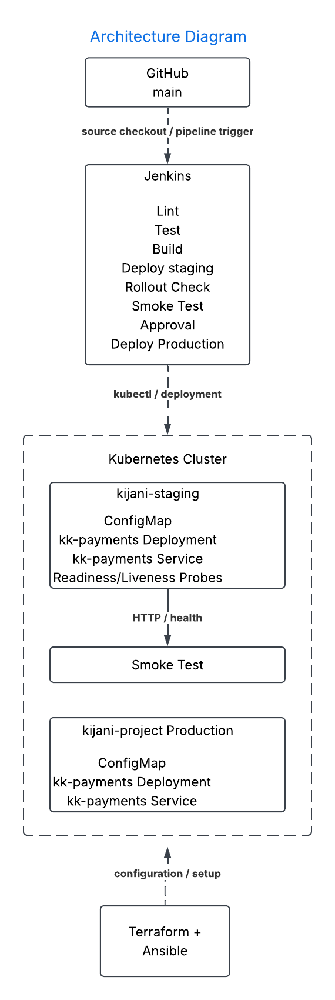

# KijaniKiosk DevOps Capstone — Track A

## What is this?

KijaniKiosk is a payments service deployment demonstrating an infrastructure-first DevOps workflow. Track A provisions an isolated Kubernetes staging environment with Terraform, configures environment-specific application settings with Ansible, deploys the `kk-payments` service to Kubernetes, validates rollout health, and runs an application smoke test before production promotion is considered.

The capstone is designed around reproducibility, environment separation, automated validation, and controlled delivery.

## Architecture



The architecture separates infrastructure provisioning, configuration management, application runtime, delivery automation, and operational validation.

### Major components

- **GitHub** — source control and the trigger point for delivery automation.
- **Jenkins** — planned CI/CD orchestration and production approval gate.
- **Terraform** — creates the isolated `kijani-staging` Kubernetes namespace.
- **Ansible** — verifies the Terraform-created namespace and configures the staging ConfigMap.
- **Kubernetes** — runs the `kk-payments` application in the staging namespace.
- **kk-payments** — the KijaniKiosk payments service.
- **Kubernetes probes** — readiness and liveness checks validate application health.
- **Smoke test** — verifies that the deployed service responds successfully.
- **Monitoring** — lightweight staging monitoring is planned as part of the remaining capstone work.

## Repository structure

```text
.
├── README.md
├── docs/
│   ├── ai-governance-log.md
│   └── architecture.png
├── capstone/
│   ├── infrastructure/
│   │   ├── terraform/
│   │   │   ├── main.tf
│   │   │   ├── variables.tf
│   │   │   └── outputs.tf
│   │   └── ansible/
│   │       ├── ansible.cfg
│   │       ├── inventory
│   │       ├── requirements.yml
│   │       ├── group_vars.yml
│   │       └── playbook.yml
│   ├── runtime/
│   │   └── kubernetes/
│   │       └── staging/
│   │           ├── kk-payments-deployment.yaml
│   │           └── kk-payments-service.yaml
│   ├── delivery/
│   │   └── jenkins/
│   └── serverless/
└── week5/
    └── friday/
        └── kijanikiosk-payments/                 
Prerequisites

The following tools are required for the local staging workflow:

Ubuntu/Linux environment
Git
Docker
Minikube
kubectl
Terraform >= 1.5
Ansible Core
Python 3
Python Kubernetes client
Ansible kubernetes.core collection

The current local Kubernetes environment uses:

Minikube 1.38.1
Kubernetes 1.35.1
Docker 29.x
Terraform 1.15.7
Ansible Core 2.21.x
Setup
1. Clone the repository
git clone https://github.com/Mungad/kijanikiosk-devops-foundation-mungad.git
cd kijanikiosk-devops-foundation-mungad
2. Start Minikube
minikube start

Verify:

minikube status
kubectl get nodes

The node must be Ready.

3. Provision the staging namespace with Terraform
cd capstone/infrastructure/terraform


terraform init
terraform fmt
terraform validate
terraform plan
terraform apply

Confirm the namespace:

kubectl get namespace kijani-staging

Expected status:

kijani-staging   Active
4. Configure staging with Ansible

Create a Python environment for the Ansible Kubernetes dependency:

cd ../ansible


python3 -m venv .venv
source .venv/bin/activate
pip install kubernetes

Install the required Ansible collection:

ansible-galaxy collection install -r requirements.yml

Run the playbook:

ansible-playbook -i inventory playbook.yml

Verify the ConfigMap:

kubectl get configmap kk-payments-config \
  -n kijani-staging \
  -o yaml

The ConfigMap must contain staging-specific values such as:

NODE_ENV: staging
DB_HOST: kijani-staging-db
APP_PORT: 3001

After completing Ansible configuration:

deactivate
rm -rf .venv
5. Deploy the staging application

From the repository root:

kubectl apply -f capstone/runtime/kubernetes/staging/

Wait for the deployment:

kubectl rollout status deployment/kk-payments \
  -n kijani-staging \
  --timeout=120s
How to run the delivery pipeline

The Jenkins delivery layer is being built incrementally.

The target workflow is:

GitHub commit/merge
        |
        v
     Jenkins
        |
        v
    Terraform
        |
        v
   Ansible configuration
        |
        v
 Kubernetes staging deployment
        |
        v
 Rollout health check
        |
        v
    Smoke test
        |
        v
 Manual production approval
        |
        v
 Production promotion

The production approval step must only become available after the staging rollout and smoke test succeed.

A failed staging rollout or failed smoke test must stop the pipeline before production promotion.

How to verify it works
Check the staging namespace
kubectl get namespace kijani-staging
Check the ConfigMap
kubectl get configmap kk-payments-config \
  -n kijani-staging
Check the deployment
kubectl get deployment kk-payments \
  -n kijani-staging

Expected result:

READY   2/2
AVAILABLE   2
Check the pods
kubectl get pods -n kijani-staging

All kk-payments pods should be Running and Ready.

Check the service
kubectl get service kk-payments \
  -n kijani-staging
Run the staging smoke test
kubectl run smoke-test \
  -n kijani-staging \
  --rm -it \
  --restart=Never \
  --image=curlimages/curl:8.12.1 \
  -- curl -fsS http://kk-payments:3001/health

A successful response is similar to:

{"status":"healthy","version":"v1.3.0-staging"}

This confirms that the application is reachable through the Kubernetes Service and that the application health endpoint is functioning.

Known limitations
The current staging environment runs on a local single-node Minikube cluster rather than a production Kubernetes cluster.
The staging database endpoint is represented by the environment-specific DB_HOST value but a database workload is not currently provisioned by this Track A implementation.
Jenkins automated delivery and the production approval gate are still being implemented.
Production promotion is not yet automated.
Monitoring and alerting are still being implemented.
The current deployment uses a local Minikube image/registry workflow and is not yet connected to a production container registry.
Production Kubernetes hardening such as TLS, ingress authentication, rate limiting, and HPA tuning is outside the current scope.
Kubernetes Secrets are intentionally not committed to Git.
Capstone success criteria

The completed system must demonstrate:

A merge to main triggers Jenkins.
Jenkins deploys kk-payments to kijani-staging.
Terraform and Ansible establish the staging environment and configuration.
Kubernetes rollout health is validated automatically.
A staging smoke test passes before production approval.
Production promotion requires human approval.
A deliberately broken staging deployment prevents production promotion.
Staging and production use the same application deployment pattern with environment-specific configuration.
Operational monitoring detects an intentionally unhealthy staging deployment.
AI-assisted work is documented in docs/ai-governance-log.md.

